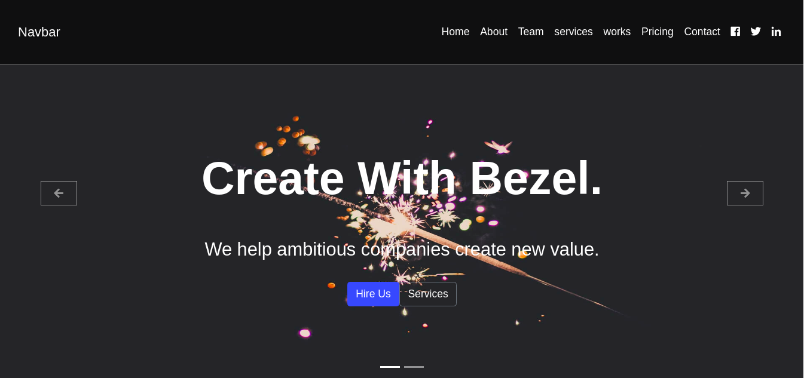
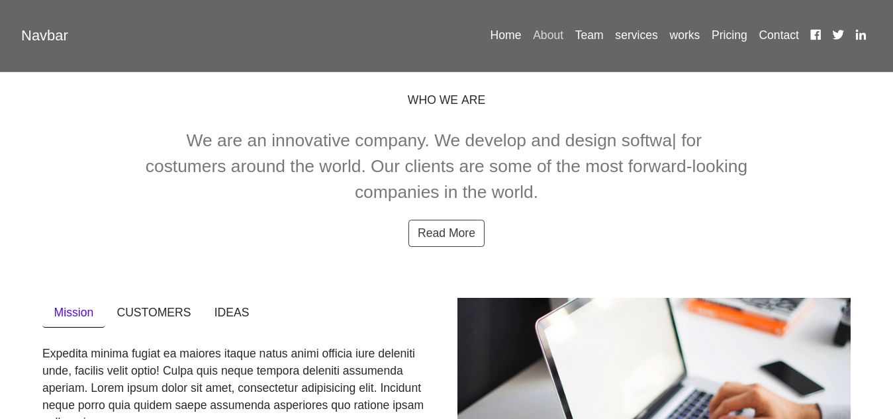

# angular_team_project
it's a simple website made with angular v6 including bootstrap, typed library, jquery , angular models.

# installation:

1- run "sudo apt install nodejs npm"

2- run "npm install -g @angular/cli"

3- run " ng serve --open --port 3030"

